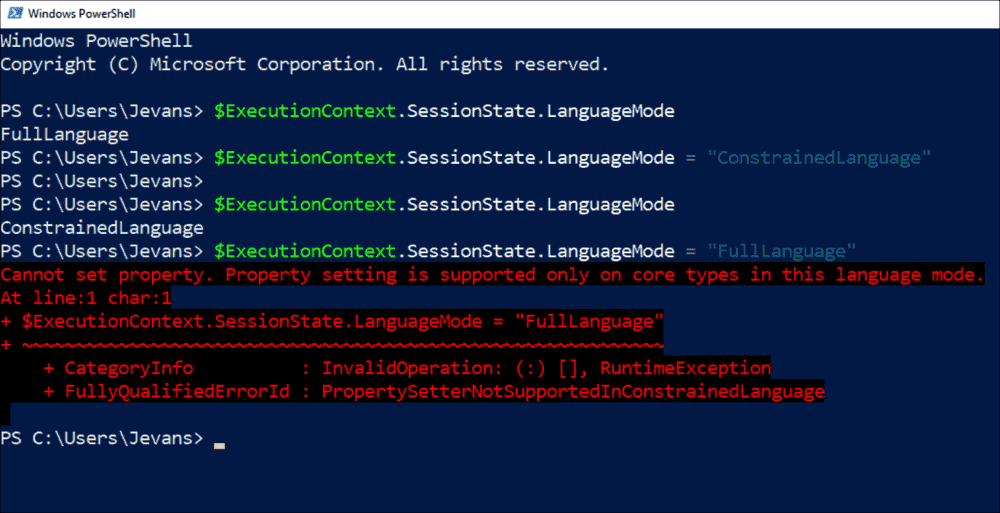
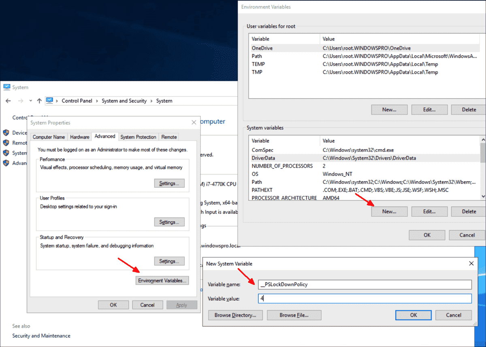
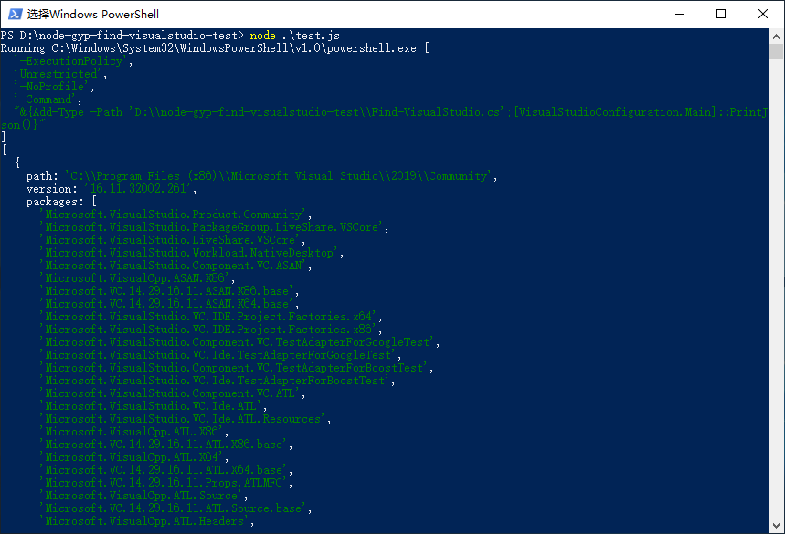

# node-gyp-find-visualstudio-test

---

source code ref: https://github.com/nodejs/node-gyp/tree/master/lib

## Trouble shooting

When the script is executed, will meet the error of `&{Add-Type -Path...`.

```bash
node ./test.js
```

Step1: check the `LanguageMode`

Open the powershell.exe and check the `LanguageMode`.

```bash
$ExecutionContext.SessionState.LanguageMode
```

We need to change the value `ConstrainedLanguage` to `FullLanguage`

<p align="center">
  
</p>

Step2: modify the __PSLockdownPolicy

<p align="center">
  
</p>

After modified the policy, try to change the `LanguageMode` again.

Step3: execute the C# scripts successfully

<p align="center">
  
</p>

After solved environmental problems above, you can get information about Visual Studio.
